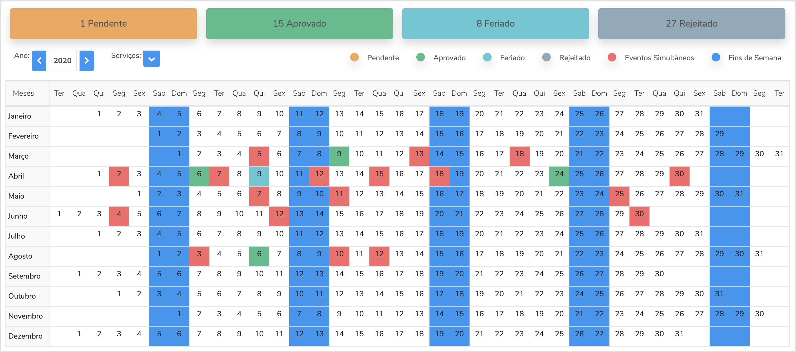

# Calendar Component

   

 

Calendar with yearly and monthly views. This component allows to create events for a single day, just clicking, or for multiples days dragging day by day.

## How to install and run

After clone the repository run `yarn` to install all dependencies.

## Development server

Run `yarn run start` for a dev server. Navigate to `http://localhost:4200/`. The app will automatically reload if you change any of the source files.

## Build

Run `yarn run build` to build the project. The build artifacts will be stored in the `dist/` directory. Use the `--prod` flag for a production build.
